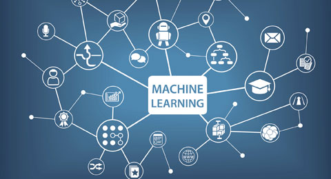

# Machine Learning

Es una *disciplina científica* del ámbito de la **Inteligencia Artificial** que crea sistemas que aprenden automáticamente. Aprender en este contexto quiere decir *identificar patrones complejos* en millones de datos.

El **aprendizaje automático** o **aprendizaje de máquinas** es el subcampo de las ciencias de la computación y una rama de la *inteligencia artificial*, cuyo objetivo es desarrollar técnicas que permitan que las computadoras aprendan.

---
### inteligencia artificial

Es la inteligencia llevada a cabo por máquinas. En ciencias de la computación, una máquina «inteligente» ideal es un agente flexible que percibe su entorno y lleva a cabo acciones que maximicen sus posibilidades de éxito en algún objetivo o tarea.

titulo 1 |  titulo 2
---|---
Elemento1 | elemento2
Elemento3 | elemento4

* Codigo Python

def plot_results(x, y, a, b):
    # Plot samples
    plt.scatter(x, y)

    # Plot line regression
    result = [(a * i) + b for i in x]
    plt.plot(x, result, 'r-', linewidth=3)

    # Plot x, y labels
    plt.xlabel('Tiempo (minutos)')
    plt.ylabel('Calorias')
    plt.show()

>esta es una cita

---

